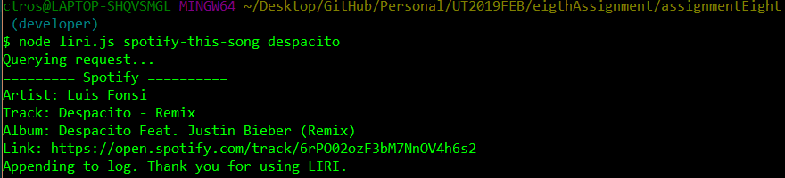
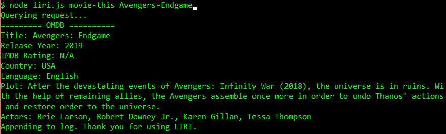
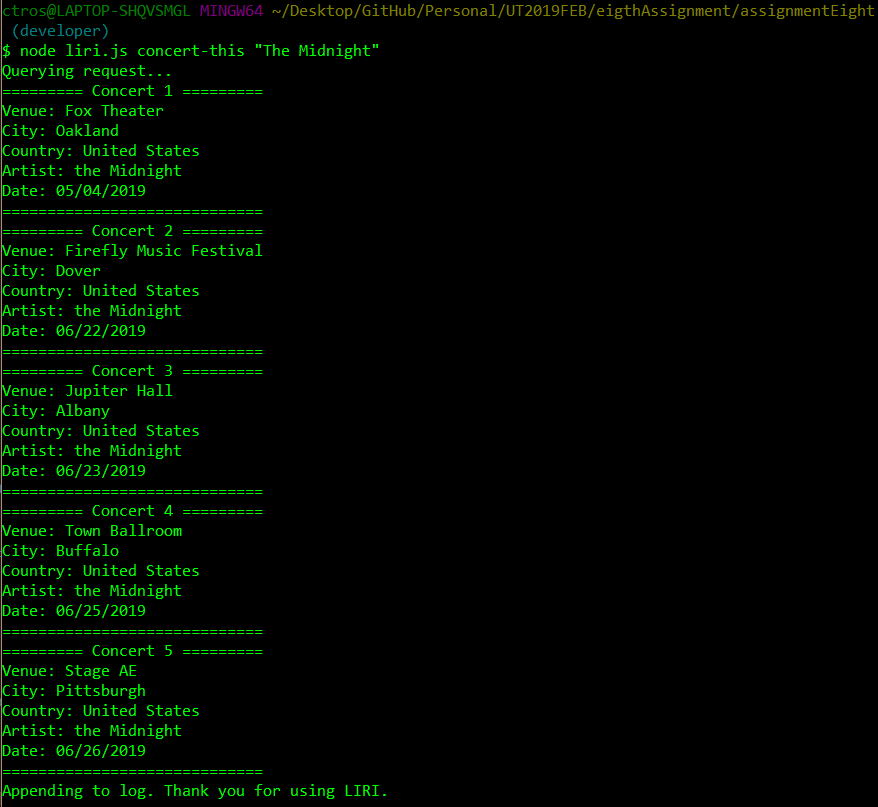
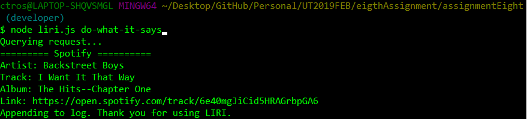
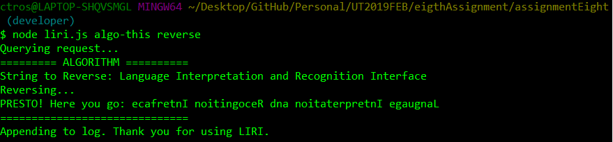

# assignmentEight
First Node.Js assignment

## Concept
Create a "Bot" using Node.Js named LIRI (Language Interpretation and Recognition Interface). LIRI is a command line node app that takes in parameters and gives back data.

## Features
- Sends request using AXIOS package
- Utilizes Bands In Town, Spotify, and OMDB APIs to provide user with relevant information on their favorite music and movies
- Logs commands into a log file

### Spotify This

- Lookup your favorite songs through LIRI
- Gives track info, artist, and a link right to Spotify

### Movie-This

- Find your favorite movies - LIRI knows them all!
- 

### Concert-This

- Curious where your favorite artists are playing? Use the "Concert-This" command to see where their performing next!
- Uses moment to properly display event dates.

### Do-What-It-Says

- *"Do What it Says":* LIRI can even take commands straight from text files!

## Bonus Feature!
- LIRI can do a few tricks from sorting numbers and reversing text!

- Reverse String (Command: Reverse)

- Sort (Command: Sort)
